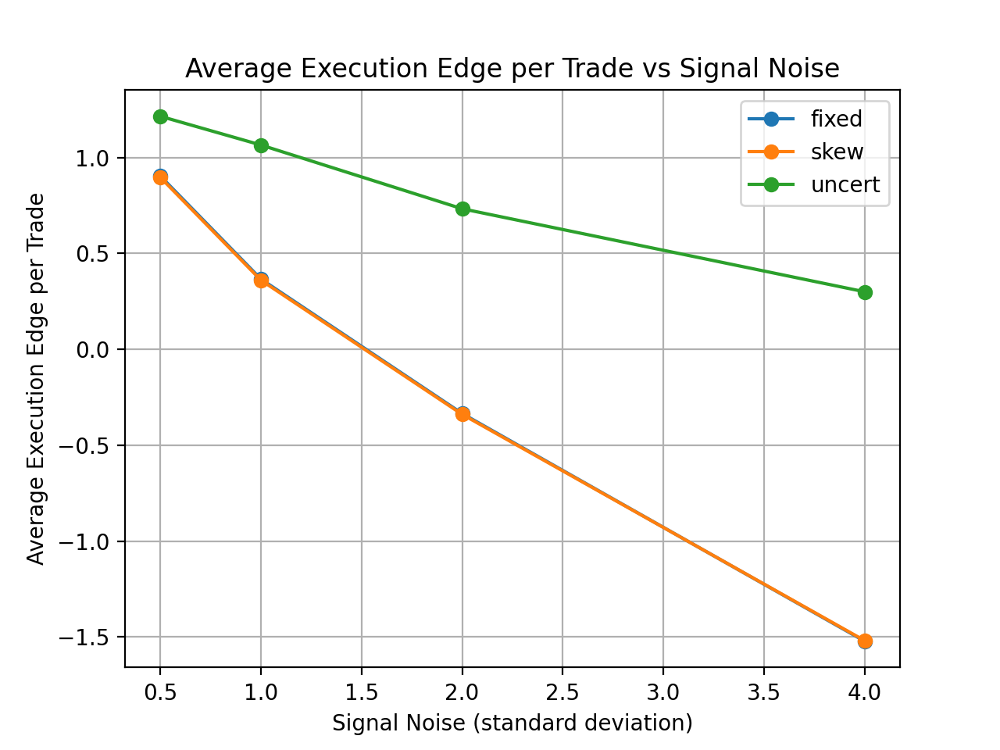

# Decision-Making Under Uncertainty: A Toy Market-Making Simulator

## 1. Project Overview

This project is a simulation of repeated decision-making under uncertainty, using a simplified model of market making as the setting.

The goal is to build a simulator that isolates and studies how different sources of risk — specifically uncertainty about information and inventory accumulation — affect outcomes when decisions must be made repeatedly over time.

At each timestep, a simulated market maker:

- observes a noisy estimate of an asset’s value,
- posts a bid (buy price) and an ask (sell price),
- interacts with one incoming trader,
- and updates cash and inventory based on whether a trade occurs.

By holding most aspects of the environment fixed and varying only specific parameters (such as signal noise or quoting rules), the simulator allows controlled comparisons between strategies.

---

## 2. How the Simulated Market Works

### True Value and Signal

- The asset has a true value that evolves over time according to a random walk. This value is not directly observable by the market maker.
- At each timestep, the true value changes slightly in a random direction.
- The market maker observes a signal, which is the true value plus noise.
- All quoting decisions are based only on the signal, not on the true value.
- This models the real-world situation where decision-makers must act on imperfect information.

### Traders (Counterparties)

Each timestep, exactly one trader arrives. There are two fixed types:

#### Noise traders

- Trade randomly.
- With some probability, they buy or sell at the posted quote.
- They ignore prices and true value entirely.
- Their role is to provide uninformed trading activity.

#### Informed traders

- Know the true value.
- Trade only when the market maker’s quote is mispriced.
- They buy if the ask is below the true value.
- They sell if the bid is above the true value.
- This creates adverse selection against the market maker.

Traders do not learn or adapt. This ensures that all observed effects come from the market maker’s decisions, not from strategic counterparty behavior.

---

## 3. Quoting Strategies

The simulator implements three quoting strategies. Each strategy takes the same inputs (signal and inventory) and produces a bid and ask.

### Strategy 1: Fixed Spread (Baseline)

- The simplest strategy.
- Quotes a constant distance above and below the signal:
  - `bid = signal - h`
  - `ask = signal + h`
- Ignores inventory and uncertainty.
- Serves as a baseline to understand how risk accumulates when no control mechanisms are used.

### Strategy 2: Inventory Skew

- Adjusts quotes based on current inventory.
- If inventory is positive (holding too much):
  - quotes are shifted downward to encourage selling.
- If inventory is negative (short position):
  - quotes are shifted upward to encourage buying.
- The goal is to reduce large inventory positions over time.
- This is a standard inventory risk-control mechanism.

### Strategy 3: Uncertainty-Aware Spread (Model-Aware)

- Widens the spread when the signal is less reliable.
- The spread increases proportionally with the known signal noise parameter:
  - `effective_half_spread = base_half_spread + α · signal_noise_std`
- This strategy is model-aware:
  - it does not infer uncertainty from data,
  - it directly uses a parameter (`signal_noise_std`) that is assumed to be known as part of the model setup.
- This allows us to study how explicitly scaling decisions with uncertainty affects outcomes.

---

## 4. Architecture and File Structure

The project is designed to be modular. Each component has a single, clear responsibility.

### Core Simulation (C++)

**`main.cc`**
- Sets up controlled experiments.
- Runs multiple simulations while varying signal noise and strategy choice.

**`config.h`**
- Holds all simulation parameters in one place (noise levels, spreads, trader mix, penalties).

**`simulator.h` / `simulator.cc`**
- Orchestrates the simulation loop:
  - advances the market,
  - selects the strategy,
  - processes trades,
  - updates cash and inventory,
  - logs results.

**`market.h` / `market.cc`**
- Models the true value dynamics and generates the noisy signal.

**`strategy.h` / `strategy.cc`**
- Defines and implements the three quoting strategies.

**`trader.h` / `trader.cc`**
- Defines trader behavior (noise vs informed).

**`rng.h` / `rng.cc`**
- Centralized random number generation for reproducibility.

**`csv.h` / `csv.cc`**
- Handles CSV output in a safe and consistent way.

### Analysis (Python)

**`analyze.py`**
- Reads simulator CSV outputs and computes summary statistics:
  - final PnL,
  - risk-adjusted PnL,
  - maximum inventory,
  - number of trades,
  - average execution edge relative to true value.

It produces:
- `data/summary.csv` (all runs),
- `data/noise_grid_summary.csv` (clean experimental comparison table).

---

## 5. Experimental Design

The main experiment varies signal noise while holding everything else constant:

- same random seed,
- same time horizon,
- same trader mix,
- same base parameters.

For each noise level, the simulator runs all three strategies and logs full timestep-by-timestep data.

This isolates the effect of information uncertainty on performance.

---

## 6. Results and Analysis

### Key Observations

#### Fixed Spread

- Performs well when signal noise is low.
- As noise increases:
  - informed traders exploit mispricing more often,
  - average edge per trade becomes negative,
  - inventory becomes more volatile.

#### Inventory Skew

- Reduces extreme inventory accumulation.
- Does not address adverse selection caused by noisy signals.

#### Uncertainty-Aware Spread

- Trades less when noise is high.
- Maintains a positive average edge across tested noise levels.
- Sacrifices volume to avoid systematically bad trades.

### Effect of Signal Noise on Execution Quality

The figure below shows how average execution edge per trade changes as signal noise increases for each quoting strategy.



As signal noise increases, fixed-spread and inventory-skew strategies suffer worsening execution quality due to adverse selection.  
The uncertainty-aware strategy trades less aggressively under high noise and preserves positive execution edge.

### Core Conclusion

A central finding of this project is:

> **Decisions should scale with uncertainty, not just point estimates.**

When uncertainty is ignored, strategies that look reasonable under low noise fail badly under high noise.  
Explicitly accounting for uncertainty — even in a simple, model-aware way — leads to more stable outcomes.

---

## 7. Limitations and Scope

This simulator is intentionally simplified:

- single asset,
- no transaction costs,
- no learning or adaptation,
- no strategic counterparties,
- no order book dynamics.

The goal is interpretability and controlled comparison, not realism.

---

## 8. Possible Extensions

- Combine inventory control and uncertainty-aware spreading.
- Infer uncertainty from realized data instead of using known parameters.
- Introduce adaptive or learning-based strategies.
- Model richer order flow or multiple assets.

---

## 9. Build and Run

```bash
make
./sim
python3 analyze.py data/*_noise_*.csv
